# Лабораторная работа №1: Построение High Availability кластера PostgreSQL (Patroni + HAProxy)

**Команда:** №22 Норкина Ярослава, Христофоров Владислав

---

## 🎯 Цель работы

Развернуть отказоустойчивый кластер PostgreSQL, который способен автоматически пережить падение Мастер-ноды без потери данных и без простоя для клиента. Реализовать автоматическое восстановление упавшей ноды.

**Используемый стек:**

-   **PostgreSQL 15** – база данных.
-   **Patroni** – управление репликацией и аварийным переключением.
-   **Zookeeper** – распределенное хранилище конфигураций.
-   **HAProxy** – балансировщик нагрузки (единая точка входа).
-   **Docker & Docker Compose** – среда выполнения.

---

## 🛠 Часть 1. Подготовка конфигурации (Базовая)

На первом этапе мы поднимаем кластер из двух нод под управлением Zookeeper.

### 1. Dockerfile

Собран кастомный образ, включающий Postgres, Python и Patroni.

<details>
<summary><b>📄 Показать код Dockerfile</b></summary>

```dockerfile
FROM postgres:15

RUN apt-get update -y && \
    apt-get install -y netcat-openbsd python3-pip curl python3-psycopg2 python3-venv iputils-ping

RUN python3 -m venv /opt/patroni-venv && \
    /opt/patroni-venv/bin/pip install --upgrade pip && \
    /opt/patroni-venv/bin/pip install patroni[zookeeper] psycopg2-binary

COPY configs/postgres0.yml /postgres0.yml
COPY configs/postgres1.yml /postgres1.yml

ENV PATH="/opt/patroni-venv/bin:$PATH"
USER postgres

```

</details>

### 2. Конфигурации Patroni

Настроены две ноды (`postgres0` и `postgres1`). Включен параметр `use_pg_rewind: true` для автоматического восстановления рассинхронизированных нод.

<details>
<summary><b>📄 Показать код configs/postgres0.yml</b></summary>

```yaml
scope: my_cluster
name: postgresql0
restapi:
    listen: pg-master:8008
    connect_address: pg-master:8008

zookeeper:
    hosts: ["zoo:2181"]

bootstrap:
    dcs:
        ttl: 30
        loop_wait: 10
        retry_timeout: 10
        maximum_lag_on_failover: 10485760
        master_start_timeout: 300
        synchronous_mode: true
        postgresql:
            use_pg_rewind: true
            use_slots: true
            parameters:
                wal_level: replica
                hot_standby: "on"
                wal_keep_segments: 8
                max_wal_senders: 10
                max_replication_slots: 10
                wal_log_hints: "on"
                archive_mode: "always"
                archive_timeout: 1800s
                archive_command: mkdir -p /tmp/wal_archive && test ! -f /tmp/wal_archive/%f && cp %p /tmp/wal_archive/%f

    pg_hba:
        - host replication replicator 0.0.0.0/0 md5
        - host all all 0.0.0.0/0 md5

postgresql:
    listen: 0.0.0.0:5432
    connect_address: pg-master:5432
    data_dir: /var/lib/postgresql/data/postgresql0
    bin_dir: /usr/lib/postgresql/15/bin
    pgpass: /tmp/pgpass0
    authentication:
        replication:
            username: replicator
            password: rep-pass
        superuser:
            username: postgres
            password: postgres
    parameters:
        unix_socket_directories: "."

watchdog:
    mode: off

tags:
    nofailover: false
    noloadbalance: false
    clonefrom: false
    nosync: false
```

</details>

_(Файл `postgres1.yml` аналогичен, но надо поменять имя, адреса и место хранения данных ноды с первой на вторую)_.

### 3. Docker Compose (Начальная версия)

Описание инфраструктуры для запуска кластера БД и Zookeeper.

<details>
<summary><b>📄 Показать код docker-compose.yml</b></summary>

```yaml
services:
    pg-master:
        build: .
        image: my-postgres-patroni
        container_name: pg-master
        restart: always
        hostname: pg-master
        environment:
            POSTGRES_USER: postgres
            POSTGRES_PASSWORD: postgres
            PGDATA: "/var/lib/postgresql/data/pgdata"
        expose:
            - 8008
        ports:
            - 5433:5432
        volumes:
            - pg-master:/var/lib/postgresql/data
        command: patroni /postgres0.yml

    pg-slave:
        build: .
        image: my-postgres-patroni
        container_name: pg-slave
        restart: always
        hostname: pg-slave
        expose:
            - 8008
        ports:
            - 5434:5432
        volumes:
            - pg-slave:/var/lib/postgresql/data
        environment:
            POSTGRES_USER: postgres
            POSTGRES_PASSWORD: postgres
            PGDATA: "/var/lib/postgresql/data/pgdata"
        command: patroni /postgres1.yml

    zoo:
        image: confluentinc/cp-zookeeper:7.7.1
        container_name: zoo
        restart: always
        hostname: zoo
        ports:
            - 2181:2181
        environment:
            ZOOKEEPER_CLIENT_PORT: 2181
            ZOOKEEPER_TICK_TIME: 2000

volumes:
    pg-master:
    pg-slave:
```

</details>

---

> 💡 _Порты 8008 и 5432 вынесены в разные директивы: `expose` и `ports`. В чем разница?_
>
> -   **`ports` (5432)**: Пробрасывает порт из контейнера на хост-машину (публикует его). Это делает сервис доступным для подключения "снаружи" Docker-сети (например, с нашего компьютера).
> -   **`expose` (8008)**: Декларирует, что контейнер "слушает" этот порт, но **не публикует** его наружу. Порт доступен только **внутри** сети Docker. В нашей работе порт 8008 (API Patroni) нужен только для HAProxy, который находится в той же сети, поэтому достаточно `expose`.

---

## 🚀 Часть 2. Запуск и инициализация

Выполняем сборку образов и запуск контейнеров в фоновом режиме:

```bash
docker-compose up -d --build
```

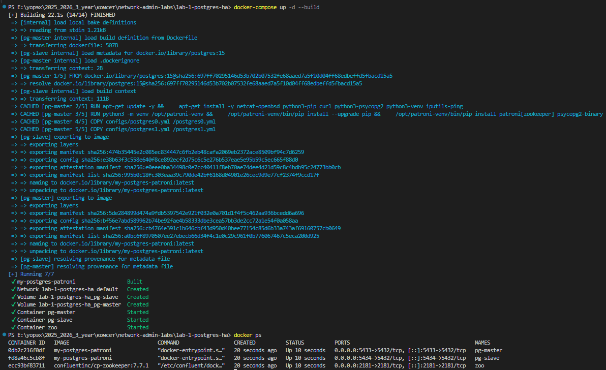

### 1. Проверка Zookeeper

Проверяем логи координатора, чтобы убедиться в успешном старте:

```bash
docker logs zoo
```

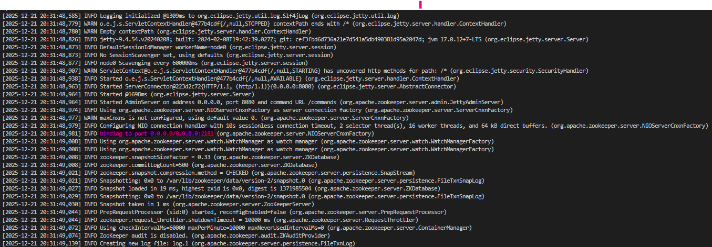

В логах присутствует строка `binding to port 0.0.0.0/0.0.0.0:2181`. Это означает, что Zookeeper успешно инициализировался и готов принимать подключения от кластера.

### 2. Проверка распределения ролей

Проверяем, что Patroni на нодах связался с Zookeeper и выбрал лидера.

```bash
docker logs pg-master
```

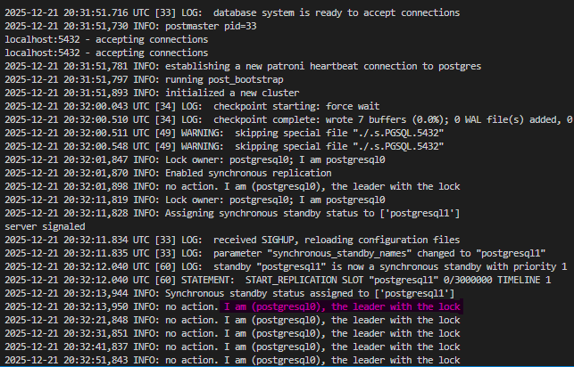

```bash
docker logs pg-slave
```

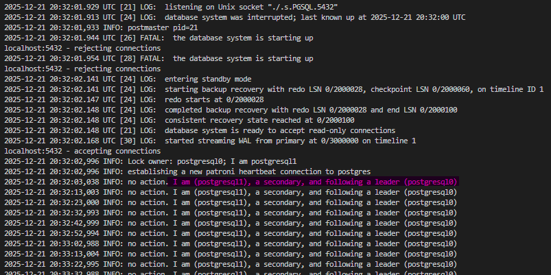

-   В логах первой ноды видим: `I am (postgresql0), the leader with the lock`. Это означает, что она выиграла выборы и стала **Лидером (Master)**.
-   В логах второй ноды видим: `I am (postgresql1), a secondary, and following a leader (postgresql0)`. Она автоматически стала **Репликой (Slave)**.

---

> 💡 _Будет ли пересобран образ при обычном перезапуске или редактировании файлов?_
>
> -   При обычном `docker-compose up` образ **не пересобирается**, Docker использует кэш.
> -   Изменения в `postgresx.yml` или `Dockerfile` **не применяются** автоматически, так как эти файлы "запекаются" внутрь образа при сборке.
> -   Для применения любых изменений в конфигурации необходимо запускать проект с флагом `--build`.

---

## 🔄 Часть 3. Проверка репликации

Проверяем синхронизацию данных, подключаясь к нодам напрямую через утилиту **SQL Shell (psql)**.

**1. Запись на Мастер (порт 5433)**

```sql
CREATE TABLE my_first_replication (id int, my_text varchar);
INSERT INTO my_first_replication VALUES (1, 'boom!');
```

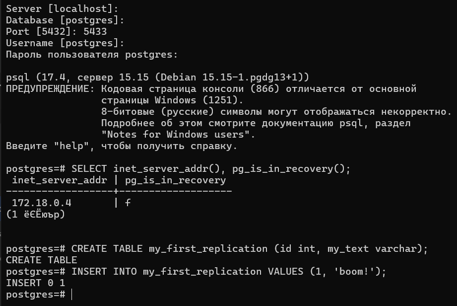

Таблица создана, данные успешно записаны на мастер-ноду.

**2. Чтение со Слейва (порт 5434)**

```sql
SELECT * FROM my_first_replication;

INSERT INTO my_first_replication VALUES (2, 'slave boom!');
```

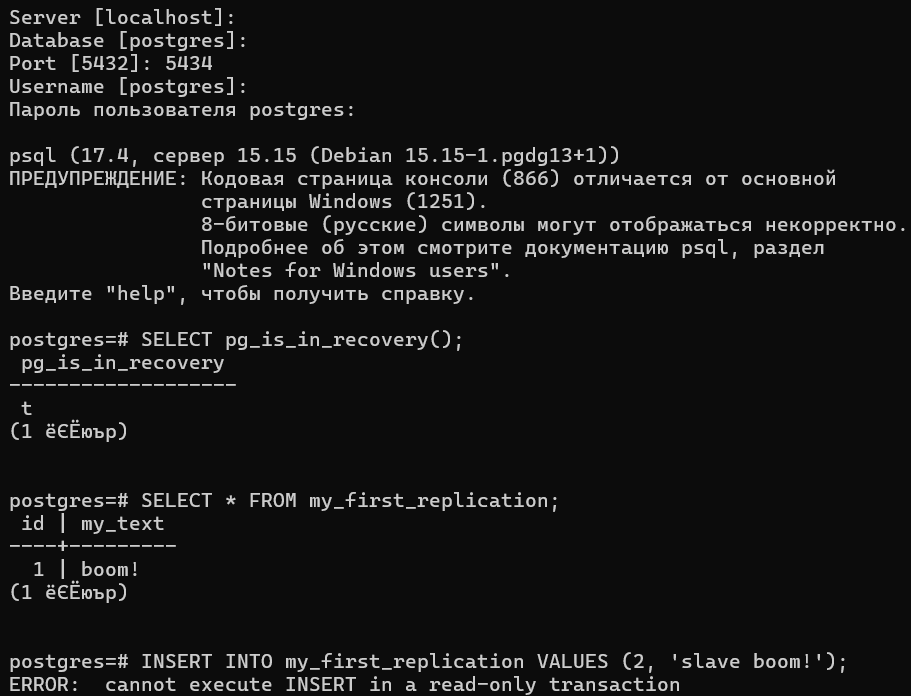

-   Запрос `SELECT` вернул строку `boom!`. **Репликация работает**, данные перенеслись на слейв.
-   Попытка `INSERT` завершилась ошибкой: `ERROR: cannot execute INSERT in a read-only transaction.`  
     Вывод: Слейв-нода корректно работает в режиме "только чтение", как и требуется в задании.

---

## 🛡 Часть 4. Внедрение HAProxy (High Availability)

Для обеспечения единой точки входа модернизируем кластер, добавляя балансировщик нагрузки.

### 1. Настройка HAProxy

Создаем файл конфигурации, который будет проверять доступность нод через REST API Patroni (порт 8008).

<details>
<summary><b>📄 Показать код configs/haproxy.cfg</b></summary>

```haproxy
global
    maxconn 100

defaults
    log global
    mode tcp
    retries 3
    timeout client 30m
    timeout connect 4s
    timeout server 30m
    timeout check 5s

listen stats
    mode http
    bind *:7000
    stats enable
    stats uri /

listen postgres
    bind *:5432
    option httpchk
    http-check expect status 200
    default-server inter 3s fall 3 rise 2 on-marked-down shutdown-sessions
    server postgresql_pg_master_5432 pg-master:5432 maxconn 100 check port 8008
    server postgresql_pg_slave_5432 pg-slave:5432 maxconn 100 check port 8008

```

</details>

### 2. Обновление Docker Compose

#### Добавляем сервис `haproxy` в файл `docker-compose.yml`.

<details>
<summary><b>📄 Код добавленного сервиса</b></summary>

```yaml
haproxy:
    image: haproxy:3.0
    container_name: postgres_entrypoint
    ports:
        - 5432:5432
        - 7000:7000
    depends_on:
        - pg-master
        - pg-slave
        - zoo
    volumes:
        - ./configs/haproxy.cfg:/usr/local/etc/haproxy/haproxy.cfg
```

</details>

### 3. Перезапуск и проверка:

1. Полностью останавливаем проект, чтобы сбросить соединения и логи:

```bash
docker-compose down
```

2. Запускаем проект заново с новым сервисом:

```bash
docker-compose up -d --build
```

Убеждаемся, что кластер собрался корректно:

```bash
docker ps

docker logs postgres_entrypoint
```

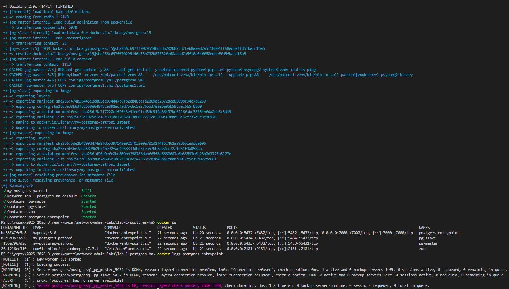

```bash
docker logs zoo
```

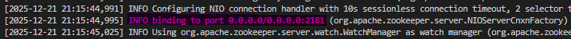

```bash
docker logs pg-master
```

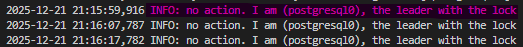

```bash
docker logs pg-slave
```

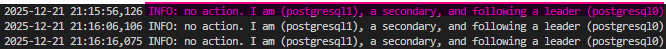

Логи показывают, что все сервисы (HAProxy, Zookeeper, Patroni) запустились корректно. Кластер пересобрался, лидер выбран заново.

### 4. Проверка маршрутизации

Подключаемся к единому порту **5432**. Проверяем, что попали на Master (Write-доступ).

```sql
SELECT inet_server_addr(), pg_is_in_recovery();
INSERT INTO my_first_replication VALUES (555, 'HA boom!');
```

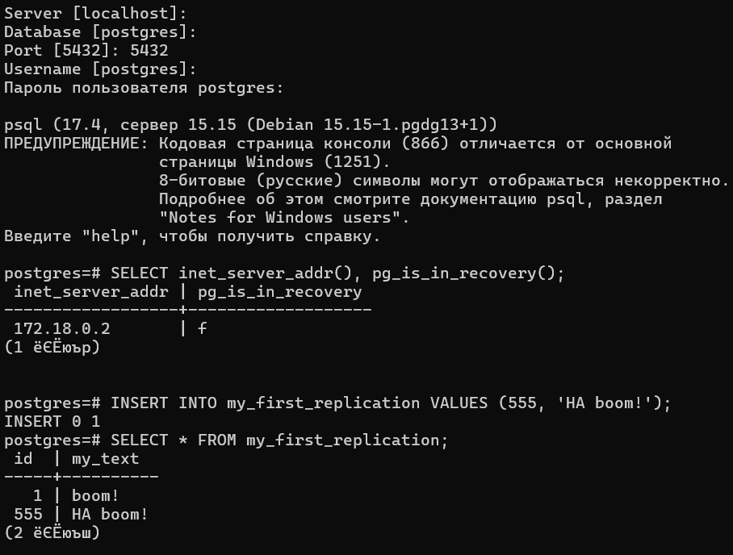

-   `pg_is_in_recovery()` вернула `f (false)`, значит текущая нода – Мастер.
-   `INSERT` прошел успешно.  
    Вывод: HAProxy работает корректно и перенаправил наш запрос на активного лидера кластера.

---

## ⚡ Часть 5. Crash Test: Автоматический Failover

**Сценарий:** Имитация аварии. Принудительно отключаем текущего лидера, пока клиент выполняет запросы.

**1. Выполняем аварию:**

```bash
docker stop pg-master
```

**2. Анализ логов выжившей ноды (`pg-slave`):**

```bash
docker logs pg-slave -f
```

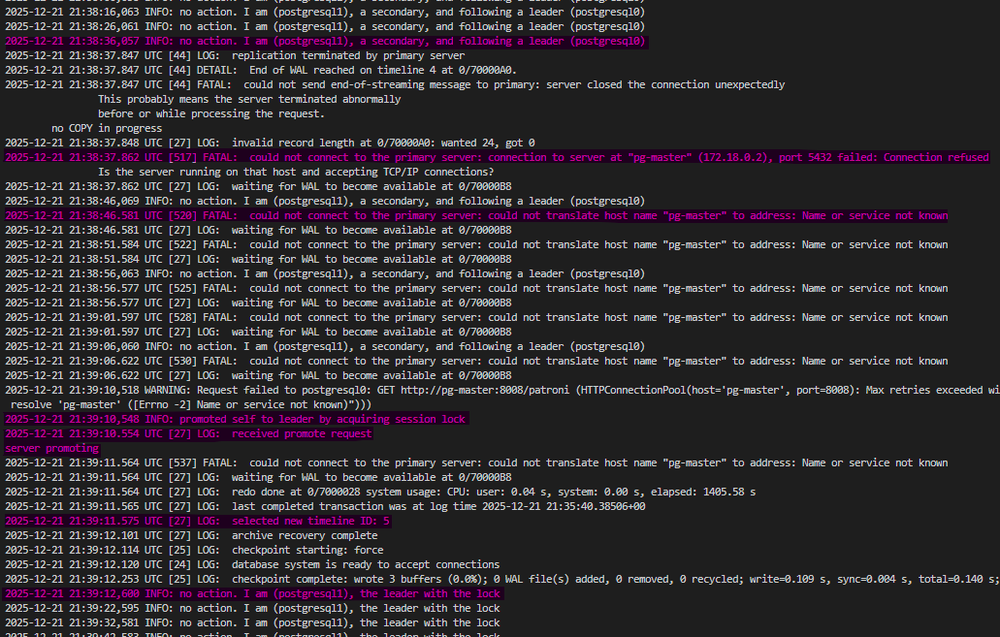

На скриншоте четко видна последовательность событий:

1. `FATAL: could not connect to primary server` – Слейв обнаружил потерю связи.
2. `promoted self to leader` – Слейв инициировал выборы и стал новым лидером.
3. `selected new timeline ID` – Произошла смена линии времени, чтобы избежать конфликтов.

**3. Проверка со стороны клиента:**
Клиент `psql` (через HAProxy) зафиксировал разрыв, но при повторном запросе был автоматически перенаправлен на новый мастер. Запись прошла успешно.

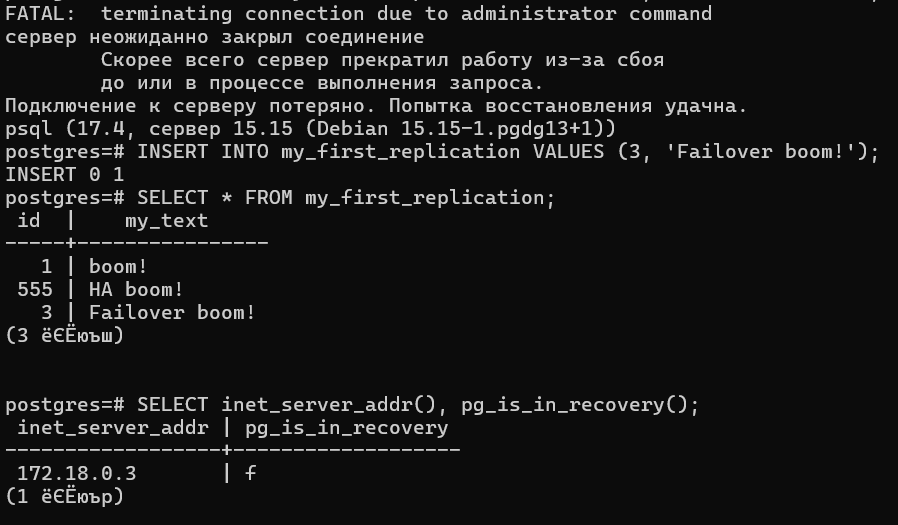

Как видно на скриншоте, после разрыва соединения клиент смог выполнить `INSERT`. Это значит, что HAProxy обнаружил падение старого мастера и автоматически перенаправил нас на новый мастер (бывший слейв). **Простоя сервиса практически не было.**

---

## ♻️ Часть 6. Self-Healing: Автоматическое восстановление

**Сценарий:** Возвращаем "мертвую" ноду в строй. Она должна понять, что отстала, и автоматически синхронизироваться.

**1. Запуск старого мастера:**

```bash
docker start pg-master
```

**2. Анализ логов (`pg-master`):**

```bash
docker logs pg-master -f
```

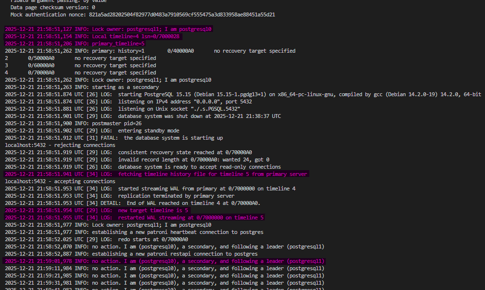

Старый мастер при запуске увидел, что лидер уже есть (`Lock owner: postgresql1`).  
Благодаря настройке `use_pg_rewind: true`, он запустил процесс синхронизации: `restarted WAL streaming ... on timeline 5.`  
Он принял новую историю изменений и перешел в режим реплики.

**3. Проверка:**
Подключаемся к восстановленной ноде (порт 5433). Теперь она – **Replica** (Read-Only). Данные, записанные во время её отсутствия, появились.

```sql
SELECT * FROM my_first_replication;
```

## 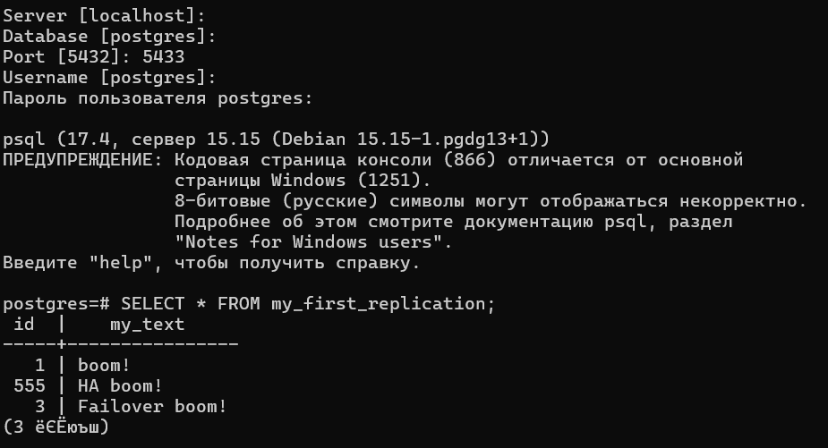

Нода вернула `t` (в режиме восстановления/реплики). Все данные, включая те, что были записаны во время её "смерти" (`Failover boom!`), успешно подтянулись.

## ✅ Выводы

В ходе работы был построен High Availability кластер PostgreSQL, удовлетворяющий всем требованиям задания:

1. **Отказоустойчивость:** При падении мастера HAProxy автоматически переключил трафик на резервную ноду.
2. **Автоматизация:** Patroni самостоятельно провел выборы лидера без участия администратора.
3. **Self-Healing:** Реализован механизм `pg_rewind`, позволяющий возвращать упавшие ноды в кластер без полной переливки данных.
