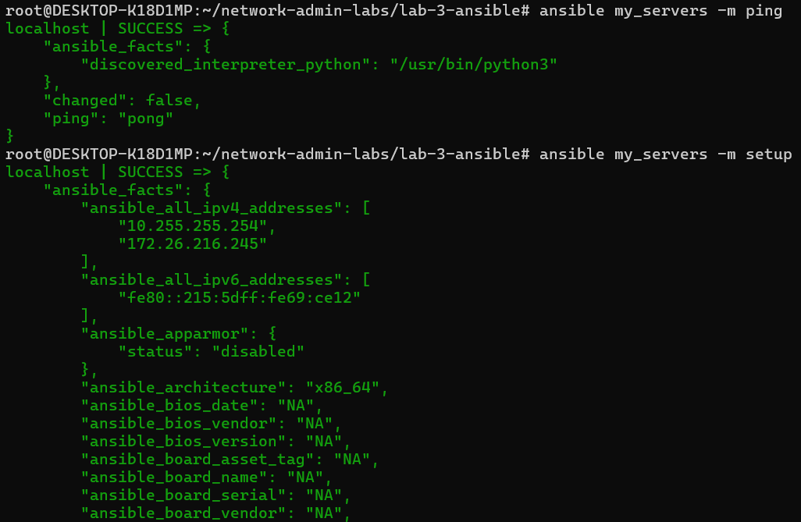
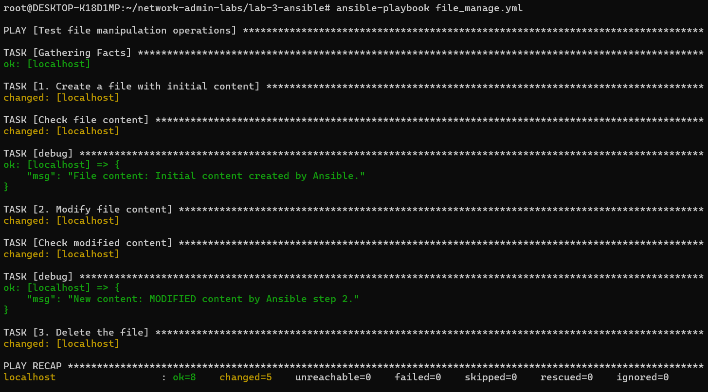
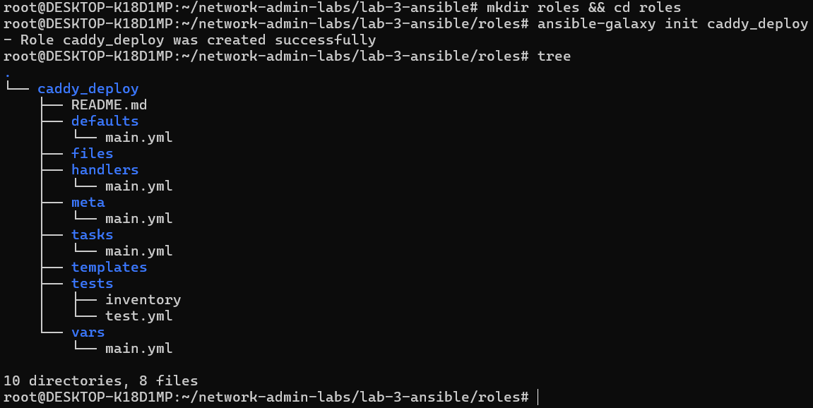
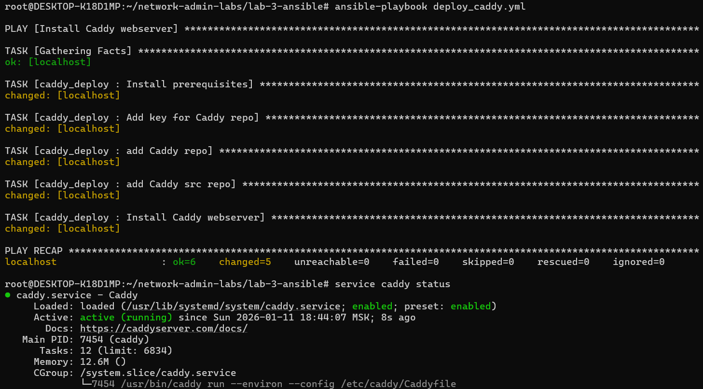
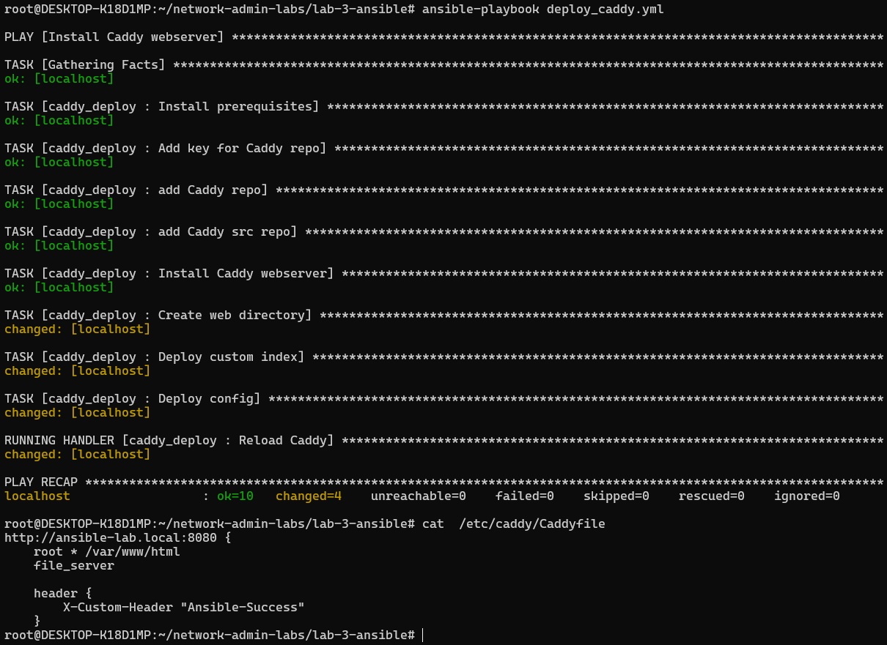
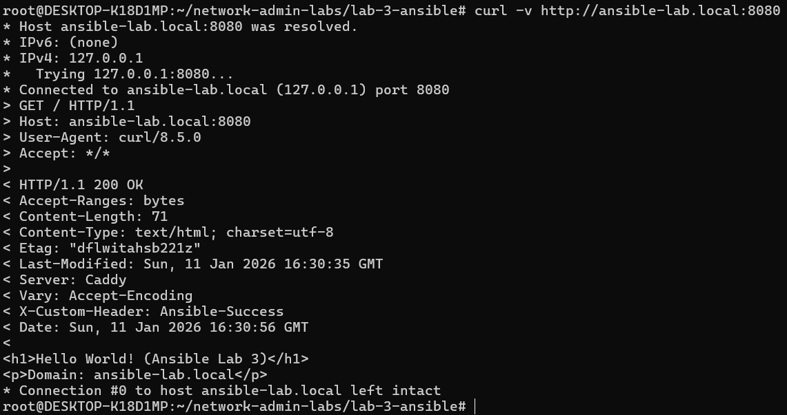

# Лабораторная работа №2: Ansible + Caddy

**Команда:** №22 Норкина Ярослава, Христофоров Владислав

## 🎯 Цель работы

На целевом сервере установить систему управления конфигурациями Ansible и с её помощью автоматизировать развертывание и настройку веб-сервера Caddy. Реализовать управление файлами через плейбуки и динамическую генерацию конфигураций.

**Используемый стек:**

-   **Ansible** – система управления конфигурациями.

-   **Caddy** – веб-сервер.

-   **Jinja2** – язык шаблонов.

-   **WSL (Ubuntu)** – среда выполнения.

## 🛠 Часть 1. Установка и настройка Ansible

На первом этапе произведена установка Ansible и подготовка окружения для работы в локальном режиме.

### 1. Установка

Выполнена установка Ansible через пакетный менеджер.

```bash
sudo apt update && sudo apt install -y ansible
```

### 2. Конфигурация

Создана рабочая директория и конфигурационные файлы.

**Файл инвентаря `inventory/hosts`:**

Описан локальный хост с параметром `ansible_connection=local` для исключения использования SSH.

```ini
[my_servers]
localhost ansible_connection=local
```

**Файл конфигурации `ansible.cfg`:**

Настроен путь к инвентарю по умолчанию.

```ini
[defaults]
host_key_checking = false
inventory = ./inventory/hosts
```

### 3. Проверка соединения

Выполнена проверка доступности хоста.

```bash
ansible my_servers -m ping

ansible my_servers -m setup
```



> **🔎 Анализ:** Получен ответ `SUCCESS` и `ping: pong`. Ansible успешно подключился к управляемому узлу.

## 📄 Часть 2. Работа с файлами

Согласно заданию, пример работы с файлами из методички переработан в формат плейбука. Добавлен шаг модификации содержимого файла.

### 1. Плейбук file_manage.yml

Написан сценарий, выполняющий полный цикл жизни файла: создание -> проверка -> изменение -> проверка -> удаление.

<details>
<summary><b>📄 Показать код file_manage.yml</b></summary>

```yaml
---
- name: Test file manipulation operations
  hosts: my_servers
  vars:
      test_file_path: "~/test_ansible.txt"

  tasks:
      # 1. Создаем файл
      - name: 1. Create a file with initial content
        copy:
            dest: "{{ test_file_path }}"
            content: "Initial content created by Ansible.\n"
            mode: "0644"

      # 2. Читаем его
      - name: Check file content
        command: "cat {{ test_file_path }}"
        register: initial_content

      - debug:
            msg: "File content: {{ initial_content.stdout }}"

      # 3. Меняем содержимое
      - name: 2. Modify file content
        copy:
            dest: "{{ test_file_path }}"
            content: "MODIFIED content by Ansible step 2.\n"
            mode: "0644"

      # 4. Проверяем изменения
      - name: Check modified content
        command: "cat {{ test_file_path }}"
        register: modified_content

      - debug:
            msg: "New content: {{ modified_content.stdout }}"

      # 5. Удаляем файл
      - name: 3. Delete the file
        file:
            path: "{{ test_file_path }}"
            state: absent
```

</details>

### 2. Запуск

```bash
ansible-playbook file_manage.yml
```



> **🔎 Анализ:** Плейбук отработал корректно. На скриншоте видны статусы `changed` (при создании и изменении файла) и вывод `debug` с измененным текстом.

## 📦 Часть 3. Установка Caddy через Роли

Для установки веб-сервера использована структура **Roles**

```bash
ansible-galaxy init caddy_deploy
```



### 1. Задачи установки (Tasks)

В файл `roles/caddy_deploy/tasks/main.yml` добавлены задачи для установки Caddy.

<details>
<summary><b>📄 Показать код tasks/main.yml (Базовая часть)</b></summary>

```yaml
---
# tasks file for caddy_deploy

- name: Install prerequisites
  apt:
      pkg:
          - debian-keyring
          - debian-archive-keyring
          - apt-transport-https
          - curl
      state: present
  become: true

- name: Add key for Caddy repo
  apt_key:
      url: https://dl.cloudsmith.io/public/caddy/stable/gpg.key
      state: present
      keyring: /usr/share/keyrings/caddy-stable-archive-keyring.gpg
  become: true

- name: add Caddy repo
  apt_repository:
      repo: "deb [signed-by=/usr/share/keyrings/caddy-stable-archive-keyring.gpg] https://dl.cloudsmith.io/public/caddy/stable/deb/debian any-version main"
      state: present
      filename: caddy-stable
  become: true

- name: add Caddy src repo
  apt_repository:
      repo: "deb-src [signed-by=/usr/share/keyrings/caddy-stable-archive-keyring.gpg] https://dl.cloudsmith.io/public/caddy/stable/deb/debian any-version main"
      state: present
      filename: caddy-stable
  become: true

- name: Install Caddy webserver
  apt:
      name: caddy
      update_cache: yes
      state: present
  become: true
```

</details>

### 2. Запуск установки

Создан главный плейбук `deploy_caddy.yml` и произведен запуск.

<details>
<summary><b>📄 Показать код deploy_caddy.yml</b></summary>

```yaml
---
- name: Install Caddy webserver
  hosts: my_servers
  connection: local
  roles:
      - caddy_deploy
```

</details>

```bash
ansible-playbook deploy_caddy.yml
```



> **💬 Комментарий:** Установка прошла успешно (`failed=0`). Сервис Caddy запущен.

## 🌐 Часть 4. Настройка конфигурации

В соответствии с заданием, конфигурация сервера расширена: настроена подмена индексной страницы, добавлены заголовки. Для выполнения использован локальный домен.

### 1. Настройка домена и переменных

В файл `/etc/hosts` добавлена запись для эмуляции домена:
`127.0.0.1 ansible-lab.local`

В переменных роли (`vars/main.yml`) заданы параметры:

```yaml
domain_name: "ansible-lab.local"
custom_header: "Ansible-Success"
```

### 2. Шаблоны (Templates)

Созданы шаблоны Jinja2 для динамической генерации файлов.

<details>
<summary><b>📄 Показать код шаблонов</b></summary>

**Caddyfile.j2 (Конфиг с заголовками):**

```text
http://{{ domain_name }}:8080 {
    root * /var/www/html
    file_server

    header {
        X-Custom-Header "{{ custom_header }}"
    }
}
```

**index.html.j2 (Кастомная страница):**

```html
<h1>Hello World! (Ansible Lab 3)</h1>
<p>Domain: {{ domain_name }}</p>
```

</details>

### 3. Обновление задач и хендлеров

В `tasks/main.yml` добавлены шаги по деплою шаблонов. В `handlers/main.yml` добавлен обработчик перезагрузки.

<details>
<summary><b>📄 Показать дополнительные задачи</b></summary>

**tasks/main.yml (добавлено):**

```yaml
# Создаем папку для сайта
- name: Create web directory
  file:
      path: /var/www/html
      state: directory
      mode: "0755"
  become: true

# Заливаем наш HTML
- name: Deploy custom index
  template:
      src: index.html.j2
      dest: /var/www/html/index.html
  become: true

# Заливаем конфиг
- name: Deploy config
  template:
      src: Caddyfile.j2
      dest: /etc/caddy/Caddyfile
  become: true
  notify: Reload Caddy
```

**handlers/main.yml**

```yaml
---
# handlers file for caddy_deploy

- name: Reload Caddy
  service:
      name: caddy
      state: reloaded
  become: true
```

</details>

**Повторный запуск плейбука:**

```bash
ansible-playbook deploy_caddy.yml
```



## ✅ Часть 5. Проверка результатов

Так как работа велась в локальном контуре без внешнего IP, проверка выполнена через утилиту `curl` с выводом заголовков.

```bash
curl -v http://ansible-lab.local:8080
```



> **🔎 Анализ результатов:**

> 1. Код ответа **200 OK** – сервер работает корректно.
> 2. Заголовок **X-Custom-Header: Ansible-Success** – конфигурация Caddyfile применена.
> 3. Тело ответа **Hello World!** – шаблон index.html применен.

## Выводы

В ходе работы изучены основы Ansible. Выполнена установка ПО, написан плейбук для манипуляции файлами, создана роль для развертывания веб-сервера. Реализована динамическая настройка конфигурации через шаблоны Jinja2, выполнено задание по кастомизации заголовков и индексной страницы.
